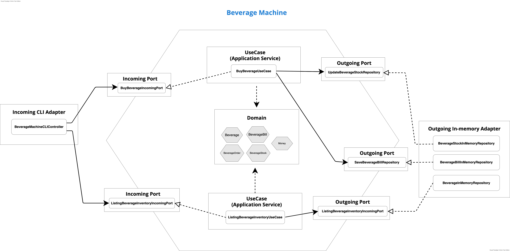

# 헥사고날아키텍처로 구현하는 음료 자판기 애플리케이션


🔥 언어는 Java로!
프레임워크 없이 순수하게 애플리케이션을 개발해보아요!

_단, 테스트 프레임워크 혹은 외부 구현기술에 의존해야하는 라이브러리 등은 필요시 적극적으로 사용해봅시다! (JUnit, H2)_


## 유스케이스
애플리케이션의 유스케이스는 복잡하지 않게 크게 두가지로 분류해보아요. 

_이 스터디의 포인트는 **헥사고날 아키텍처**의 구현이기 때문에, 문제를 간단하게 만들어봅시다._

- 구매자는 음료를 구매한다
- 관리자는 음료를 관리한다

## 애플리케이션 아키텍처 (헥사고날 아키텍처)


## 애플리케이션 모듈 컴포넌트 구조

유스케이스에 의해 애플리케이션은 크게 두개의 컴포넌트로 실행할 수 있게끔 구현해보아요
- 구매자(buyer) 앱
- 관리자(admin) 앱


## 고려사항

- 입출력 유효성 검증
  - 입력 커맨드 객체에서 유효성 검증을 하도록 구현
  - 엔티티의 상태에 의한 유효성 검증이 필요하다면 서비스에서 구현
- 빈약한 Entity vs 풍부한 Entity
  - 도메인 주도 설계를 기반으로 순수한 도메인을 유지할 수 있는 애플리케이션을 구현해보기 위해서 **풍부한 Entity**로 구현해보아요 _(실무에서는 순수한 도메인을 유지하기 어려운 상황이 많으니 스터디에서라도 많이 경험해보고 인사이트를 얻어가보아요)_

- 헥사고날 아키텍처를 기반으로 한 향후 확장성이 어떻게 구현될 수 있는지 직접 경험
  - 헥사고날 아키텍처의 장점을 직접적으로 경험할 수 있게, 처음 구현은 외부 사항(`Adapter`)들을 최대한 미루고 구현이 완료되면 외부 사항(`Adapter`)를 교체해보아요.
    - 처음 구현에는 Persistence Adapter에 Database 구현기술을 바로 사용하지 않고, In-Mememory 구조로 구현했다가 `Adapter`를 나중에 교체해보아요.
- TDD?
  - **풍분한 Entity** 로 진행한다면 TDD도 자연스럽게 진행할 수 있을 것 같아요.
- 아키텍처 경계 매핑방법
  - 내부에서 외부를 의존하지 않는 선에서, `매핑하지 않기` + `양방향 매핑` 정도로 매핑해보아요.
- 애플리케이션 조립 (DI)
  - `Spring`과 같은 프레임워크를 사용하지 않기 때문에, DI 지원을 받을 수 없어요. 직접 애플리케이션 조립 모듈(configuration)에서 DI를 직접 구현해보아요.
 
 ## 음료 자판기 '음료를 구매한다' 입출력 예시
```plain
금액을 입력해주세요(금액 입력을 종료하시려면 0을 입력해주세요): 100원, 500원, 1000원, 5000원, 10000원 단위 입력 가능
1000
금액을 입력해주세요(금액 입력을 종료하시려면 0을 입력해주세요): 100원, 500원, 1000원, 5000원, 10000원 단위 입력 가능
1000
금액을 입력해주세요(금액 입력을 종료하시려면 0을 입력해주세요): 100원, 500원, 1000원, 5000원, 10000원 단위 입력 가능
1000
금액을 입력해주세요(금액 입력을 종료하시려면 0을 입력해주세요): 100원, 500원, 1000원, 5000원, 10000원 단위 입력 가능
0

구매하실 음료의 번호를 입력해주세요(구매를 종료하시려면 0을 입력해주세요): 음료번호] 음료명(가격, 남은 재고)
1] 웰치스(1000, 5), 2] 스프라이트(1200, 2), 3] 코카콜라(1200, 3), 4] 밀키스(900, 3)
1

구매하실 음료의 번호를 입력해주세요(구매를 종료하시려면 0을 입력해주세요): 음료번호] 음료명(가격, 남은 재고)
1] 웰치스(1000, 4), 2] 스프라이트(1200, 2), 3] 코카콜라(1200, 3), 4] 밀키스(900, 3)
2

구매하실 음료의 번호를 입력해주세요(구매를 종료하시려면 0을 입력해주세요): 음료번호] 음료명(가격, 남은 재고)
1] 웰치스(1000, 4), 2] 스프라이트(1200, 1), 3] 코카콜라(1200, 3), 4] 밀키스(900, 3)
0

구매해주셔서 감사합니다.
------------------------------------------------------
구매한 음료 총 금액: 2200원
거스름돈 금액: 800원
구매한 음료 목록:
- 웰치스 1개
- 스프라이트 1개
```

